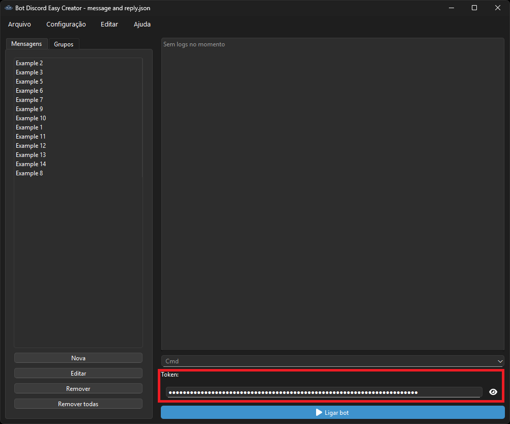
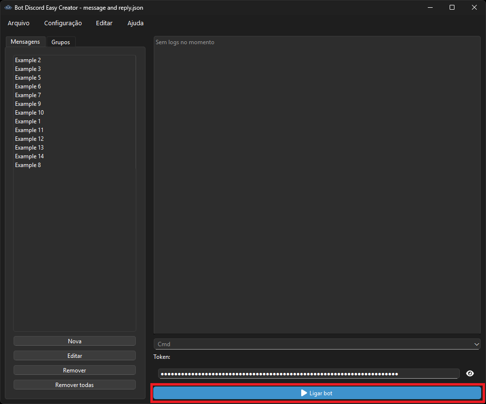

<p align="center">
  
</p>

# Bot Discord Easy Creator

## Sobre:

**Bot Discord Easy Creator**, é um software gratuito para criação de bots no Discord, com interface interativa capaz
de executar o bot.

## Como iniciar:

### 1º Passo: Instalando dependências e bibliotecas

##### Linguagens:

* [Python 3.12.6](https://www.python.org/downloads/release/python-3126/)

##### Bibliotecas Python:

* [discord.py](https://pypi.org/project/discord.py/) - 2.4.0
* [emojis](https://pypi.org/project/emojis/) - 0.7.0
* [PySide6](https://pypi.org/project/PySide6/) - 6.8.1.1

#### Instalação:

Abra o cmd e digite:

```bash
pip install -r requirements.txt
```

Esse processo pode ser realizado a partir da interface.

### 2º Passo: Interface

Para iniciar a interface do bot, digite no cmd:

```bash
python messages.py
```

### 3º Passo: Inserindo o token

Para inserir o token, clique no campo Token da interface, insira e aperte Enter para salvar.



Se preferir pode copiar o token do seu bot e inserir no arquivo config.yaml, por exemplo:

```yaml
token: <seu token>
```

### 4º Passo: Iniciando Bot

Para iniciar o Bot basta clicar no botão Ligar Bot:



Ou se já tiver uma configuração de mensagens e desejar executar o bot separadamente, digite no cmd:

```bash
python bot.py
```

## Não tem um token?

### Para vincular seu bot ao Discord, siga este passo a passo:

* Acesse o site do desenvolvedor do [Discord](https://discord.com/developers) e clique em "Applications", 
  depois selecione "New Application".
* Dê um nome ao seu bot e clique em "Create". Você será redirecionado para um painel onde poderá adicionar mais 
  informações, como imagem, descrição e tags.
* No menu à esquerda, clique na opção "Bot" e, em seguida, em "Add Bot".

Após a criação você deve encontrar o Token na mesma pagina.

## Customizando o bot:

### Janela inicial:

Na janela inicial podemos criar, editar, excluir e visualizar as mensagens que configuramos,
podemos também executar o bot e visualizar as mensagens de retorno (logs).

Ao clicar no botão de adicionar ou editar podemos visualizar uma nova janela.

### Janela de edição:

Nessa janela podemos criar ou editar uma mensagem, que configura como o Bot deve reagir às mensagens enviadas no
servidor ou privado. Agora vamos introduzir como podem ser utilizados os cinco campos de preenchimento:

* **Nome**: O nome que deseja salvar essa mensagem.
* **Mensagem esperada**: Mensagem que será utilizada pelas condições de "expected message" e "not expected message", nesse
  campo se tivermos mais de uma mensagem, todas serão enviadas, separando uma mensagem com ¨ podemos definir mensagens
  aleatórias.
* **Resposta**: São as mensagens que devemos enviar como reposta caso todas as condições forem satisfeitas.
* **Reações**: O bot irá reagir com todas as reações definidas.
* **Condições**: Define condições as mensagens que deverão ser respondidas.

#### Configurando a resposta:

Podemos configurar as "formas" de resposta, como:

* Resposta no grupo ou privada.
* Banimento ou expulsão como resposta.
* Onde serão adicionadas as reações (bot ou usuário).
* Delay na resposta.
* Remover ou fixar a mensagem.

# Para desenvolvedores:

## Desenvolvendo traduções:

Para iniciar o desenvolvimento de traduções, você precisa ter o **Qt Linguist** instalado (O Qt Linguist deve estar na 
pasta do Qt), pois iremos utilizá-lo para traduzir cada widget da interface.
Vamos começar gerando os arquivos .ts a partir das interfaces, exemplo:
    
```bash
pyside6-lupdate -extensions py .venv/Lib/site-packages/extra_qwidgets ./interfaces bot.py -ts translations/pt_br.ts 
pyside6-lupdate -extensions py .venv/Lib/site-packages/extra_qwidgets ./interfaces bot.py -ts translations/en_us.ts
```

Agora abra o arquivo .ts gerado e traduza cada widget, após isso, compile o arquivo com o comando:

```bash
pyside6-lrelease translations/pt_br.ts -qm translations/build/pt_br.qm
pyside6-lrelease translations/en_us.ts -qm translations/build/en_us.qm
```

## Compilando:

Para compilar o programa, basta executar o seguinte comando:
```bash
python setup.py build
```
Mais configurações podem ser realizadas no setup.py.